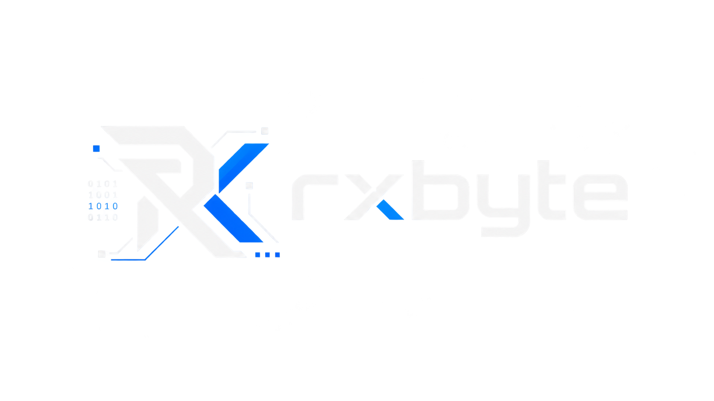

<div align="center">



<br>

<a href="https://github.com/rxbyte">
  
</a>
<a href="https://www.rxbyte.dev">
  
</a>
<a href="https://discord.gg/rxbyte">
  
</a>
<a href="https://x.com/@rxbyte">
  
</a>

<br><br>


</div>

---

## `> whoami`

```text
rxbyte

software engineer focused on building clean, useful and reliable software.

8+ years of programming
Czechia

focus:
  ├─ web development
  ├─ backend & APIs
  ├─ low-level programming
  ├─ Linux
  ├─ automation
  ├─ open source
  └─ AI

philosophy:
  build → break → understand → improve
```

## `> stack`

### Languages

<p>
  
  
  
  
  
  
  
  
</p>

### Frameworks & Tools

<p>
  
  
  
  
  
  
</p>

---

## `> featured_projects`

<div align="center">

| `01` | `02` | `03` |
|:---:|:---:|:---:|
| **COMING SOON** | **COMING SOON** | **COMING SOON** |
| Open-source project | Backend / API project | Experimental build |
| `████████░░` | `███████░░░` | `█████░░░░░` |

</div>

> Project cards will be populated as the public portfolio grows.

---

## `> github_stats`

<div align="center">

<a href="https://github.com/rxbyte">
  
</a>
<a href="https://github.com/rxbyte">
  
</a>

<br><br>


<br><br>


</div>

---

## `> activity`

<div align="center">


</div>

---

## `> connect`

```text
[01] discord   →  discord.gg/rxbyte
[02] github    →  github.com/rxbyte
[03] website   →  www.rxbyte.dev
[04] x         →  x.com/@rxbyte
[05] youtube   →  youtube.com/rxbyte
[06] email     →  mail@rxbyte.dev
```

<p align="center">
  <a href="https://discord.gg/rxbyte">Discord</a>
  ·
  <a href="https://github.com/rxbyte">GitHub</a>
  ·
  <a href="https://www.rxbyte.dev">Website</a>
  ·
  <a href="https://x.com/@rxbyte">X</a>
  ·
  <a href="https://youtube.com/rxbyte">YouTube</a>
  ·
  <a href="mailto:mail@rxbyte.dev">Email</a>
</p>

---

<div align="center">


<br><br>

```text
────────────────────────────────────────────────────────────
                 MADE IN CZECHIA  /  RXBYTE
────────────────────────────────────────────────────────────
```

<sub>Code is the medium. Curiosity is the engine.</sub>

</div>
